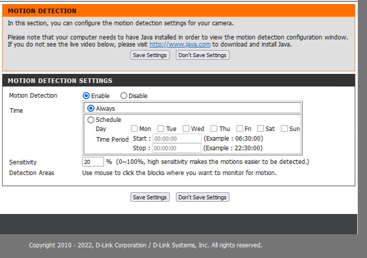
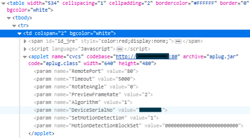
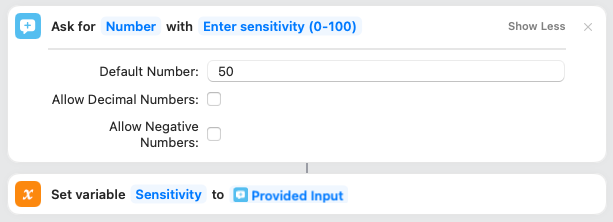
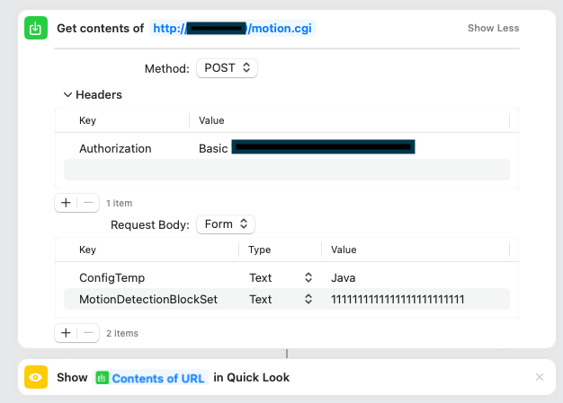
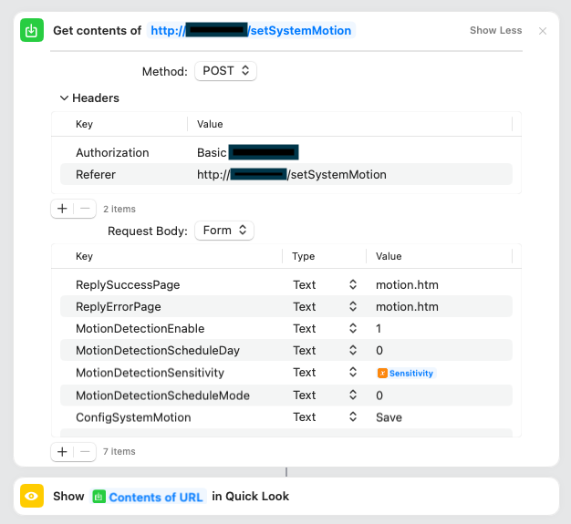

# The Problem

I have a couple of D-Link [DCS-930L](https://support.dlink.ca/ProductInfo.aspx?m=DCS-930L) cameras that I don't use anymore.  These cameras are quite old, but they still work and can still be useful in the right circumstances.

I wanted to set one up for my parents to keep an eye on a stray cat that they're feeding.  This camera meets all of the requirements - it can connect to a Wifi network, perform motion detection, and send email.  Unfortunately, configuring the motion detection is impossible on a modern browser as it relies on a Java applet:



As you can see, there is no option to select the motion detection zones.

Since my needs for this camera are very simple, I just want a way to enable option detection and don't really care about restricting detection to specific parts of the image.  So, how do I flag the entire image as eligible for motion detection?

# The Investigation

## The HTML User Interface

First, I inspected the source code and see if there is any obvious way that the selections in the Java applet get communicated back to the camera.  Spoiler alert:  there isn't.

Next, I looked at the source code that invokes the Java applet:



You can see a parameter that describes the motion detection areas in the image, `MotionDetectionBlockSet`.  The image is broken down into a 5x5 grid, each bit in the `MotionDetectionBlockSet` parameter represents one of those grid squares.

I investigated the various bits of JavaScript served up by the camera and see no obvious way that the page interrogates the applet in order to post the data back to the camera when you save.  So how does the applet tell the camera what motion detection zones to use?

## The Applet

Investigating the applet involved retrieving it from the camera and using [JD-GUI](https://github.com/java-decompiler/jd-gui) to decompile the applet.

My analysis found that the applet makes a POST call to `http://<camera>/motion.cgi`, passes in a Basic Authorization header, and the following parameters:

```
ConfigTemp=Java&MotionDetectionBlockSet=1111111111111111111111111
```

But doing this isn't enough to actually set the motion detection parameters.  After the applet has set the MotionDetectionBlockSet, you still have to click Save on the web page.  Clicking Save on the web page results in a POST call to `http://<camera>/setSystemMotion` with a Basic Authorization header and the following parameters:

```
ReplySuccessPage=motion.htm&ReplyErrorPage=motion.htm&MotionDetectionEnable=1&MotionDetectionScheduleDay=0&MotionDetectionScheduleMode=0&MotionDetectionSensitivity=90&ConfigSystemMotion=Save
```

While testing, I discovered that the camera checks the `Referer` header.

# The Solution

As mentioned earlier, the whole point of this was to allow my parents to use the camera to keep an eye on a stray cat.  Using the findings above, I created a Shortcut to allow my mom to easily turn on the motion detection and adjust the camera's motion sensitivity.

The shortcut looks like this:

Get sensitivity from user:



POST the new MotionDetectionBlockSet:



POST the motion detection settings from the web page:



One of the parameters to the Java applet is `DeviceSerialNo`.  This is actually the Basic authorization that you need to use when interacting with the camera.